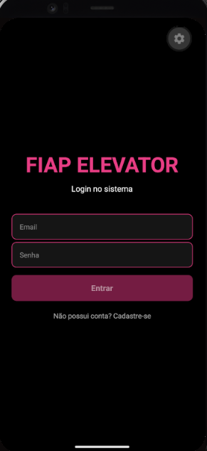
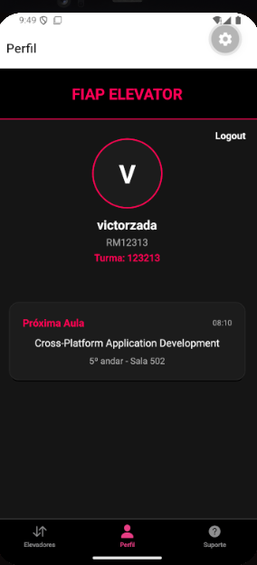
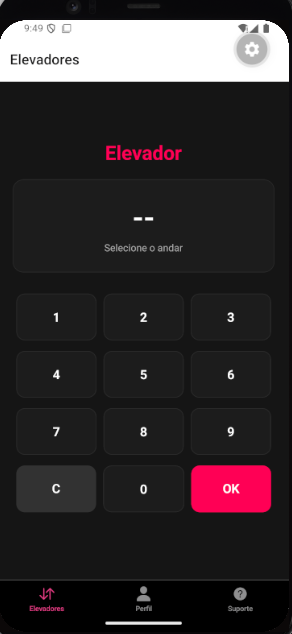
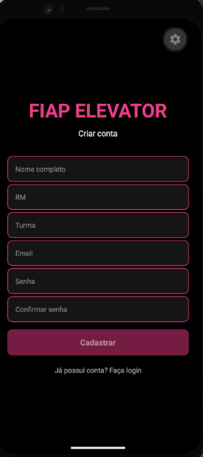
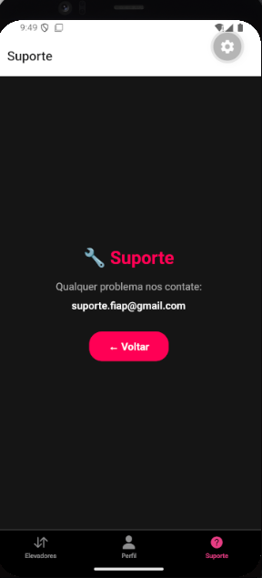

#  FIAP Elevator

##  a) Sobre o Projeto

O **FIAP Elevator** é um aplicativo desenvolvido para otimizar o uso dos elevadores dentro da FIAP.

###  Problema

Atualmente, quando um aluno deseja usar o elevador, ele precisa:

1. Ir até o local dos elevadores
2. Selecionar o andar desejado
3. Aguardar o elevador chegar (normalmente demora xD)

Isso gera **tempo de espera desnecessário**.

###  Solução

Com o app, o usuário pode:

* Solicitar o elevador **antes mesmo de chegar ao local**
* Fazer isso diretamente da sala de aula, por exemplo, a aula pode estar acabando e ele já chama o elevador para poupar tempo
---

###  Gif do app


###  Tela de Login


###  Tela de Perfil


###  Tela de Elevadores


###  Tela de cadastro


###  Tela de Suporte

---

### Funcionalidades

Cadastro de usuários
Login com autenticação local
Persistência de sessão
Perfil do usuário
Upload de foto de perfil
Solicitação de elevador remotamente
Interface simples e intuitiva
Navegação por abas
Tela de suporte

---

## b) Integrantes do Grupo

* **Amom Ianaguivara Brito** — RM: 565718
* **Victor Chen** — RM: 565363
* **Fernando Antônio** — RM: 562549

---

## c) Como Rodar o Projeto

### ✅ Pré-requisitos

Você precisa ter instalado:

* Node.js
* VS Code
* Android Studio
* Expo Go (no celular ou emulador)
* JavaScript (ambiente já incluso com Node)

---

### 📱 Configuração do Emulador

1. Abra o Android Studio
2. Crie um dispositivo virtual (Eu usei no meu pc o pixel 5, porém no pc da FIAP está instalado o pixel 4 então deve ir de boa também)
3. Inicie o emulador

---

### Passo a passo

```bash
# Clonar o repositório
git clone https://github.com/SEU-USUARIO/meu-app.git
OU
Você pode baixar o zip no meu repositório extrair e abrir o folder no vscode que funciona legal

# Entrar na pasta
cd meu-app

# Instalar dependências
npm install
```
Caso o npm install de erro rode:
```bash
npm install react@19.2.6 react-dom@19.2.6
```
e de npm install de novo
Bibliotecas utilizadas

```bash
npx expo install expo-router
npx expo install react-native-safe-area-context
npx expo install react-native-screens
npx expo install react-native-gesture-handler
npx expo install react-native-reanimated
npx expo install @react-native-async-storage/async-storage
npx expo install expo-image-picker
npx expo install @expo/vector-icons
```
---

#### Limpar cache do Expo

```bash
npx expo start -c
```

---

### Rodar o projeto

```bash
npx expo start
```

Depois:

* Pressione **"a"** para abrir no Android Emulator
  ou
* Escaneie o QR Code com o Expo Go

---


### Estrutura do Projeto

```bash
FIAP-CPAD-CP1-ELEVATOR-APP-MAN
│
├── app
│   ├── (auth)
│   │   ├── _layout.js
│   │   ├── cadastro.js
│   │   └── login.js
│   │
│   ├── (tabs)
│   │   ├── _layout.js
│   │   ├── elevadores.js
│   │   ├── index.js
│   │   └── suporte1.js
│   │
│   └── _layout.js
│
├── components
│   ├── Button.js
│   ├── CardAula.js
│   ├── Header.js
│   └── Input.js
│
├── context
│   └── AuthContext.js
│
├── assets
├── docs
├── package.json
└── README.md
```

## Decisões Técnicas

O projeto foi organizado utilizando o **Expo Router**, com separação de rotas:

- `(auth)` → telas de autenticação
- `(tabs)` → navegação principal
- `_layout.js` → controle de navegação

---

## Hooks Utilizados

- `useState` → controle de estados
- `useEffect` → carregamento de sessão
- `useContext` → autenticação global
- `useRouter` → navegação entre telas

---

## Navegação

- Implementada com **Expo Router**
- Uso de **Tabs** para navegação principal
- Tela de login separada das abas

---

## Componentes Criados

### Button.js

Componente reutilizável de botão.

### Input.js

Componente reutilizável de input com validação visual.

### Header.js

Cabeçalho personalizado do aplicativo.

### CardAula.js

Card exibindo informações da próxima aula.

---

## Context API

Foi utilizado um `AuthContext` para:

- Login
- Logout
- Persistência de sessão
- Controle global do usuário

---

## AsyncStorage

Utilizado para armazenar:

- Usuário cadastrado
- Sessão de login
- Foto de perfil

---

## Expo Image Picker

Utilizado para:

- Escolher foto da galeria
- Atualizar foto do perfil

---

## Decisão do Diferencial

Escolhemos adicionar foto de perfil como diferencial do projeto.

---

## Próximos Passos

Com mais tempo, o grupo implementaria:

- Integração com API real
- Banco de dados online
- Notificações push
- Histórico de chamadas do elevador
- Melhor estilização dos alerts
- Mais personalização do perfil
- Controle real de elevadores via IoT

---

## Tecnologias Utilizadas

- React Native
- Expo
- Expo Router
- JavaScript
- React Context API
- AsyncStorage
- Expo Image Picker
- React Navigation
- Ionicons
- Android Studio
- Android Emulator Pixel 5 API

---
